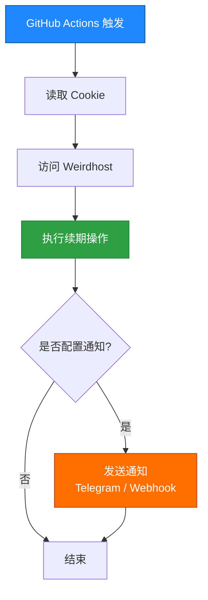
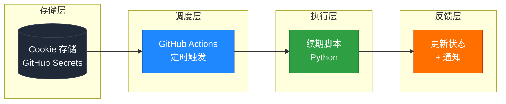

# 🚀 Weirdhost Auto Renew

> 一个基于 GitHub Actions 的 Weirdhost 账号自动续期工具 · 零服务器 · 零抓包 · 多账号支持

---

## ✨ 项目特点速览

| # | 特性 | 说明 |
|:---:|:---|:---|
| 🧩 | **无需抓包接口** | 直接复用浏览器 Cookie，绕过接口逆向 |
| 🍪 | **Cookie 模式稳定** | 与 Weirdhost 官方登录态一致，长期可用 |
| 👥 | **支持多账号** | 通过 `WEIRDH0ST_COOKIE_N` 环境变量扩展至 N 个账号 |
| ⏰ | **GitHub Actions 自动运行** | 默认每天 UTC 00:00 定时触发，零服务器维护 |
| 🔔 | **可扩展通知系统** | 支持 Telegram Bot / Webhook 通知推送 |
| 🔒 | **安全存储** | 所有敏感凭据通过 GitHub Secrets 加密存储 |

---

## 📌 1. 项目用途

本项目用于：

- 🔐 自动登录 Weirdhost
- ♻️ 自动保持 Cookie 有效
- ⏰ 定时执行续期任务
- 👥 支持多账号
- 📢 支持通知推送（Telegram / Webhook）

---

## 🌐 2. 环境准备

你只需要：

| # | 资源 | 用途 |
|:---:|:---|:---|
| 1️⃣ | **GitHub 账号** | 托管代码与运行 GitHub Actions |
| 2️⃣ | **Weirdhost 账号** | 续期目标账号 |
| 3️⃣ | **浏览器** | 用于获取 Cookie（Chrome / Edge / Firefox 均可） |

---

## 📦 3. 一键部署流程

### ✅ Step 1：Fork 仓库

点击右上角：

> 👉 [**Fork**](#)

或创建自己的仓库并上传代码

---

### 🔐 Step 2：配置 Secrets（必须）

进入：

> 👉 **Settings** → **Secrets and variables** → **Actions**

点击：

> 👉 **New repository secret**

---

### 🍪 Step 3：添加 Cookie（核心）

在 Secrets 中添加以下条目：

| Name | Value |
|:---|:---|
| `WEIRDH0ST_COOKIE_1` | 账号 1 Cookie |
| `WEIRDH0ST_COOKIE_2` | 账号 2 Cookie（可选） |
| `WEIRDH0ST_COOKIE_3` | 账号 3 Cookie（可选） |

#### 📍 Cookie 获取方法

1. 打开 👉 <https://hub.weirdhost.xyz>
2. 登录账号
3. 按 `F12` → **Application**
4. 找到：`remember_web_xxx`
5. 复制完整 Cookie 值
6. 粘贴到 GitHub Secrets

> 💡 **提示**：Cookie 必须是完整的 `key=value; key=value; ...` 格式，缺失任一字段均会导致续期失败。

---

### 📢 Step 4：通知配置（可选）

#### Telegram 通知

| Name | Value |
|:---|:---|
| `TG_BOT_TOKEN` | Bot Token |
| `TG_CHAT_ID` | 用户 Chat ID |

#### Webhook 通知（可选扩展）

| Name | Value |
|:---|:---|
| `WEBHOOK_URL` | 接收通知的 Webhook 接口地址 |

---

### ▶️ Step 5：首次运行（必须）

进入：

> 👉 **Actions**

找到 workflow：

> 👉 **`auto-renew`**

点击：

> 👉 **Run workflow**

> ⚠️ **注意**：GitHub 默认会禁用 Fork 仓库的 Actions，请先在 Actions 页面手动点击 **"I understand my workflows, go ahead and enable them"** 启用。

---

## ⏰ 4. 自动运行时间

默认定时：

| 时区 | 触发时间 |
|:---|:---|
| 🌍 UTC | 每天 `00:00` |
| 🇨🇳 北京时间（UTC+8） | 每天 `08:00 AM` |

---

## 🔄 5. 运行流程说明

系统运行逻辑如下：

---

## ⚠️ 6. 常见问题

<b>❌ Cookie 失效</b>

> 👉 重新登录 <https://hub.weirdhost.xyz> 获取最新 Cookie，并更新 GitHub Secrets 中的 `WEIRDH0ST_COOKIE_N`。

<b>❌ Actions 不执行</b>

检查：

- ✅ 是否在 **Actions** 页面启用 GitHub Actions
- ✅ 是否手动运行过一次 workflow
- ✅ Fork 仓库需手动开启 workflows 权限

<b>❌ 多账号不生效</b>

确认：

- ✅ `WEIRDH0ST_COOKIE_1`
- ✅ `WEIRDH0ST_COOKIE_2`
- ✅ ……

是否按顺序正确填写（变量名大小写敏感，需保持 `WEIRDH0ST` 全大写 + 数字下标）。

<b>❌ 没有通知</b>

检查：

- ✅ `TG_BOT_TOKEN` 是否正确
- ✅ `TG_CHAT_ID` 是否正确
- ✅ Bot 是否已被加入目标会话

---

## 📊 7. 项目特点

✔ 无需抓包接口
✔ Cookie 模式稳定
✔ 支持多账号
✔ GitHub Actions 自动运行
✔ 可扩展通知系统

---

## 🧠 8. 架构说明

---

## 📌 9. 安全提示

> ⚠️ **Cookie 属于敏感信息，请勿泄露**
> 任何持有你 Cookie 的人都可以完全控制你的 Weirdhost 账号。

> 🔒 **建议使用 Private 仓库**
> Public 仓库虽然不会暴露 Secrets，但会公开你的项目结构与运行日志（若 Actions 日志未脱敏，可能存在风险）。

> 🔄 **定期更新 Cookie**
> 建议每 30 天重新登录一次并更新 Cookie，以避免因 Weirdhost 服务端 Session 过期导致续期失败。

---

## 📄 License

本项目基于 **MIT License** 开源。

---

**如果这个项目对你有帮助，请点一个 ⭐ Star 支持一下！**

Made with ❤️ for the open-source community

