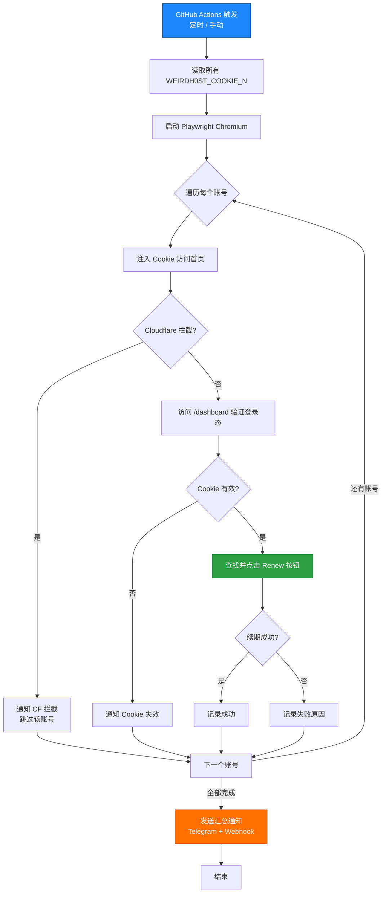
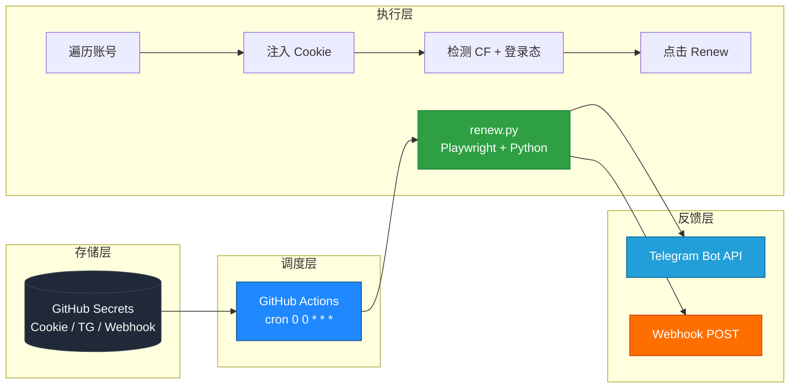

<div align="center">

# 🚀 Weirdhost Auto Renew

> 一个基于 GitHub Actions 的 Weirdhost 账号自动续期工具 · 零服务器 · Cookie 模式 · 多账号支持


</div>

---

## ✨ 项目特点速览

| # | 特性 | 说明 |
|:---:|:---|:---|
| 🧩 | **无需抓包接口** | 直接复用浏览器 Cookie，绕过接口逆向 |
| 🍪 | **Cookie 模式稳定** | 与 Weirdhost 官方登录态一致，长期可用 |
| 👥 | **支持多账号** | 通过 `WEIRDH0ST_COOKIE_N` 环境变量扩展至 N 个账号 |
| ⏰ | **GitHub Actions 自动运行** | 默认每天 UTC 00:00 定时触发，零服务器维护 |
| 🔔 | **双通道通知** | 同时支持 Telegram Bot 和 Webhook 推送 |
| 🔒 | **安全存储** | 所有敏感凭据通过 GitHub Secrets 加密存储 |
| ☁️ | **Cloudflare 检测** | 自动识别 CF 拦截页并通知用户重试 |
| 🛡️ | **完整异常处理** | try/finally 保证浏览器资源回收，单账号失败不影响其他账号 |

---

## 📌 1. 项目用途

本项目用于：

- 🔐 自动登录 Weirdhost（基于 Cookie，无需账号密码）
- ♻️ 自动保持 Cookie 有效
- ⏰ 定时执行续期任务
- 👥 支持多账号（最多 50 个，按 `WEIRDH0ST_COOKIE_N` 顺序读取）
- 📢 支持通知推送（Telegram + Webhook 双通道，可任选其一或同时启用）

---

## 🌐 2. 环境准备

你只需要：

| # | 资源 | 用途 |
|:---:|:---|:---|
| 1️⃣ | **GitHub 账号** | 托管代码与运行 GitHub Actions |
| 2️⃣ | **Weirdhost 账号** | 续期目标账号 |
| 3️⃣ | **浏览器** | 用于获取 Cookie（Chrome / Edge / Firefox 均可） |

---

## 📦 3. 一键部署流程

### ✅ Step 1：Fork 仓库

点击右上角：

> 👉 [**Fork**](https://github.com/weikkadd/wdsaf/fork)

或创建自己的仓库并上传代码

---

### 🔐 Step 2：配置 Secrets（必须）

进入 Fork 后的仓库：

> 👉 **Settings** → **Secrets and variables** → **Actions**

点击：

> 👉 **New repository secret**

---

### 🍪 Step 3：添加 Cookie（核心）

在 Secrets 中添加以下条目（按需添加，至少 1 个）：

| Name | Value | 必填 |
|:---|:---|:---:|
| `WEIRDH0ST_COOKIE_1` | 账号 1 Cookie | ✅ |
| `WEIRDH0ST_COOKIE_2` | 账号 2 Cookie | 可选 |
| `WEIRDH0ST_COOKIE_3` | 账号 3 Cookie | 可选 |
| `WEIRDH0ST_COOKIE_4` | 账号 4 Cookie | 可选 |
| `WEIRDH0ST_COOKIE_5` | 账号 5 Cookie | 可选 |
| ... | 最多支持 50 个账号 | 可选 |

> ⚠️ **变量名大小写敏感**：必须是 `WEIRDH0ST`（中间是数字 `0`，不是字母 `O`），后接下划线 + 数字下标。

#### 📍 Cookie 获取方法

1. 打开 👉 <https://hub.weirdhost.xyz>
2. 登录账号
3. 按 `F12` → 切换到 **Application** 标签
4. 左侧展开 **Cookies** → 选择 `https://hub.weirdhost.xyz`
5. 找到关键 Cookie：`remember_web_xxx`（也可能有 `session` / `XSRF-TOKEN` 等）
6. 复制完整 Cookie 值

#### ✅ Cookie 正确格式

```
remember_web_xxx=eyJpdiI6...; session=abc123; XSRF-TOKEN=xyz789
```

> 💡 **提示**：建议直接从浏览器开发者工具的 **Network** 标签 → 任一请求的 **Request Headers** → `Cookie:` 字段中复制完整值，最稳妥。

---

### 📢 Step 4：通知配置（可选，但强烈建议）

支持 **Telegram** 和 **Webhook** 两种通知方式，可任选其一，也可同时启用。

#### 方式 A：Telegram 通知

| Name | Value |
|:---|:---|
| `TG_BOT_TOKEN` | Bot Token（从 [@BotFather](https://t.me/BotFather) 获取） |
| `TG_CHAT_ID` | 接收通知的用户/群组 Chat ID（可从 [@userinfobot](https://t.me/userinfobot) 获取） |

#### 方式 B：Webhook 通知

| Name | Value |
|:---|:---|
| `WEBHOOK_URL` | 接收通知的 Webhook 接口地址（接收 POST JSON：`{title, content, ts}`） |

> 💡 两种方式都未配置时，脚本仍会正常运行，只是不发送通知（运行日志可在 Actions 页面查看）。

---

### ▶️ Step 5：首次运行（必须）

进入：

> 👉 **Actions**

找到 workflow：

> 👉 **`auto-renew`**

点击：

> 👉 **Run workflow**

> ⚠️ **注意**：GitHub 默认会禁用 Fork 仓库的 Actions。请先在 Actions 页面手动点击 **"I understand my workflows, go ahead and enable them"** 启用。
> 
> ⚠️ **更重要**：Fork 仓库的 **定时任务（schedule）默认不触发**，必须先手动 Run 一次 workflow 后，定时任务才会生效。

---

## ⏰ 4. 自动运行时间

默认定时：

| 时区 | 触发时间 |
|:---|:---|
| 🌍 UTC | 每天 `00:00` |
| 🇨🇳 北京时间（UTC+8） | 每天 `08:00 AM` |

> 💡 **GitHub Actions 限制**：定时任务在 60 天内无任何活动（无 push、无手动 Run）会被自动禁用。建议偶尔手动 Run 一次保持活跃。

---

## 🔄 5. 运行流程说明

系统运行逻辑如下：



---

## ⚠️ 6. 常见问题

<details>
<summary><b>❌ Cookie 失效</b></summary>

**症状**：通知显示 `Cookie 已失效，请重新登录获取最新 Cookie`

**解决**：
1. 重新登录 <https://hub.weirdhost.xyz>
2. 按 F12 → Application → Cookies 获取最新 Cookie
3. 更新 GitHub Secrets 中对应的 `WEIRDH0ST_COOKIE_N`
4. 手动 Run 一次 workflow 验证
</details>

<details>
<summary><b>❌ Actions 不执行</b></summary>

检查清单：

- ✅ 是否在 **Actions** 页面点击 "I understand my workflows, go ahead and enable them" 启用 Actions
- ✅ 是否**手动 Run 过一次 workflow**（Fork 仓库的 schedule 触发需要先手动运行一次激活）
- ✅ 是否 60 天内有过任意活动（push / manual run），否则 schedule 会被自动禁用
- ✅ workflow 文件位于 `.github/workflows/renew.yml` 且 YAML 缩进正确
</details>

<details>
<summary><b>❌ 多账号不生效</b></summary>

确认：

- ✅ 变量名严格为 `WEIRDH0ST_COOKIE_1`、`WEIRDH0ST_COOKIE_2`、`WEIRDH0ST_COOKIE_3`...
- ✅ 中间是数字 `0`（不是字母 `O`）
- ✅ 数字必须**从 1 开始连续**（如只有 `WEIRDH0ST_COOKIE_1` 和 `WEIRDH0ST_COOKIE_3` 而没有 `_2`，只会读第一个）
- ✅ 每个值都是完整的 Cookie 字符串，不能跨多个 Secret 拼接

脚本最多扫描到 `WEIRDH0ST_COOKIE_50`，足够日常使用。
</details>

<details>
<summary><b>❌ Cloudflare 拦截</b></summary>

**症状**：通知显示 `Cloudflare 拦截，请稍后重试或更换网络环境`

**原因**：GitHub Actions 的 IP 段有时会触发 Cloudflare 风控

**解决**：
1. 等待几小时后手动 Run 一次（通常是临时风控）
2. 如果持续拦截，可考虑：
   - 使用代理（修改 `renew.py` 中 `proxy` 参数）
   - 自建服务器运行（脱离 GitHub IP 段）
</details>

<details>
<summary><b>❌ 没有收到通知</b></summary>

**Telegram 检查**：
- ✅ `TG_BOT_TOKEN` 是否正确（从 @BotFather 复制完整 token）
- ✅ `TG_CHAT_ID` 是否正确（数字 ID，不是用户名）
- ✅ Bot 是否已向目标会话发送过 `/start`（首次必须由用户主动发起）

**Webhook 检查**：
- ✅ `WEBHOOK_URL` 是否可公网访问
- ✅ 接口是否能接收 POST + JSON body（`{title, content, ts}`）
- ✅ 接口返回 200 状态码
</details>

<details>
<summary><b>❌ 找不到 Renew 按钮</b></summary>

**症状**：通知显示 `未发现 Renew 按钮，可能本周期已自动续期`

**说明**：Weirdhost 的续期按钮通常只在临近到期时出现。如果当前账号未到续期窗口，dashboard 上不会有按钮，脚本会视为"已自动续期"并标记成功。如确认需要续期但按钮未出现，请手动登录网页确认状态。
</details>

---

## 📊 7. 项目特点

✔ 无需抓包接口
✔ Cookie 模式稳定
✔ 支持多账号（最多 50 个）
✔ GitHub Actions 自动运行
✔ Telegram + Webhook 双通道通知
✔ Cloudflare 拦截检测
✔ 完整异常处理与资源回收

---

## 🧠 8. 架构说明



---

## 📁 9. 项目结构

```
weirdhost-auto-renew/
├── .github/
│   └── workflows/
│       └── renew.yml          # GitHub Actions 定时任务
├── renew.py                   # 续期主脚本
├── requirements.txt           # Python 依赖
└── README.md                  # 项目文档
```

---

## 📌 10. 安全提示

> ⚠️ **Cookie 属于敏感信息，请勿泄露**
> 任何持有你 Cookie 的人都可以完全控制你的 Weirdhost 账号。

> 🔒 **建议使用 Private 仓库**
> Public 仓库虽然不会暴露 Secrets，但会公开你的项目结构与运行日志（若 Actions 日志未脱敏，可能存在风险）。

> 🔄 **定期更新 Cookie**
> 建议每 30 天重新登录一次并更新 Cookie，以避免因 Weirdhost 服务端 Session 过期导致续期失败。

> 🚫 **不要在 Issues / PR 中粘贴 Cookie**
> 提问时请用 `***` 替代任何 Cookie 片段。

---

## 🔧 11. 本地调试

如需在本地测试脚本：

```bash
# 1. 安装依赖
pip install -r requirements.txt
playwright install chromium

# 2. 设置环境变量（至少设置 1 个 Cookie）
export WEIRDH0ST_COOKIE_1="your_cookie_here"
export TG_BOT_TOKEN="your_bot_token"        # 可选
export TG_CHAT_ID="your_chat_id"            # 可选

# 3. 运行
python renew.py
```

---

## 📄 License

本项目基于 **MIT License** 开源。

---

<div align="center">

**如果这个项目对你有帮助，请点一个 ⭐ Star 支持一下！**

Made with ❤️ for the open-source community

</div>
